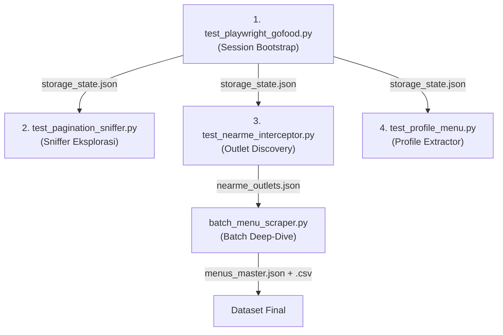
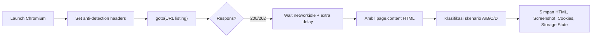
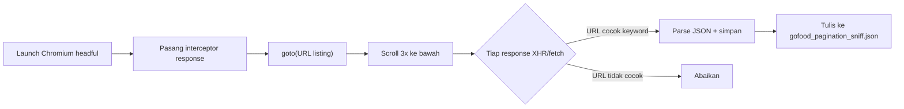
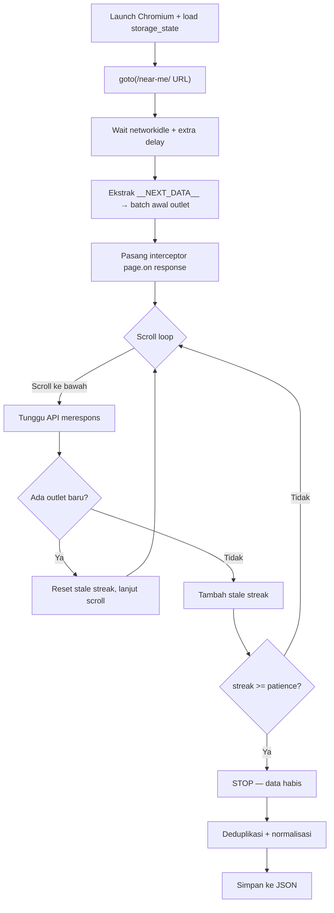
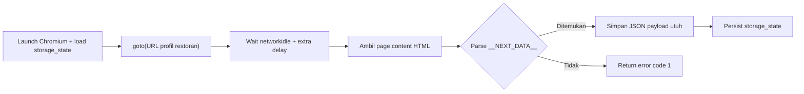
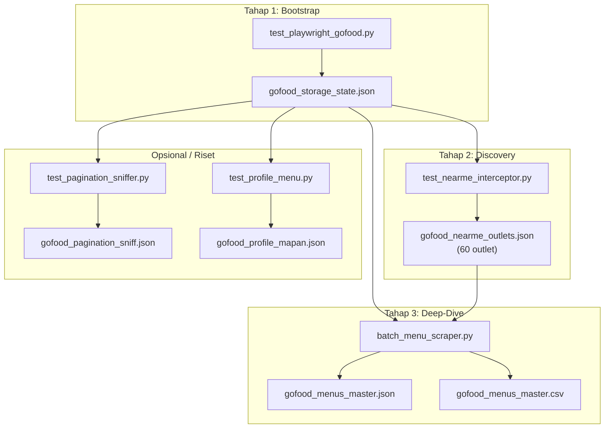

# Playwright Flow — Alur Kerja Script Scraping GoFood

Dokumen ini menjelaskan alur kerja dari setiap script di folder `scripts/playwright/`, bagaimana mereka saling terhubung, dan urutan eksekusinya dalam pipeline.

---

## Gambaran Umum Pipeline



> [!NOTE]
> Script **1** wajib dijalankan terlebih dahulu karena menghasilkan file sesi (`storage_state.json`) yang dibutuhkan semua script lainnya. Script **2** bersifat eksploratif/opsional. Script **3** dan **4** adalah inti produksi.

---

## 1. `test_playwright_gofood.py` — Session Bootstrap

**Peran:** Menembus pertahanan awal WAF/Cloudflare GoFood dan menyimpan sesi browser agar script lain tidak perlu mengulang proses verifikasi.

### Alur Internal



### Detail Proses

| Langkah | Apa yang terjadi | Output |
|---------|-----------------|--------|
| Launch browser | Chromium dibuka dengan flag `--disable-blink-features=AutomationControlled` agar tidak terdeteksi sebagai bot | — |
| Anti-detection | User-Agent Chrome 120, locale `id-ID`, timezone `Asia/Jakarta` | — |
| Navigasi | Buka URL listing (default: Sukolilo) dengan `wait_until="domcontentloaded"` | HTTP status code |
| Wait | `networkidle` + tambahan `--wait-ms` (default 12 detik) untuk memberi waktu JS selesai render | — |
| Klasifikasi | Fungsi `classify_scenario()` mengecek HTML untuk menentukan respons server | Skenario A/B/C/D |
| Ekstraksi awal | Coba parse `__NEXT_DATA__` dari HTML, tampilkan contoh outlet | Daftar nama outlet |
| Simpan state | `context.storage_state()` menyimpan cookies + localStorage ke file | `gofood_storage_state.json` |

### Skenario Klasifikasi

| Skenario | Kondisi | Artinya |
|----------|---------|---------|
| **A** (Jackpot) | Nama restoran terkenal muncul di HTML | SSR penuh, data ada di HTML langsung |
| **B** (Next.js) | Tag `__NEXT_DATA__` ditemukan | Data ada di JSON embedded |
| **C** (The Wall) | Keyword anti-bot (`captcha`, `cloudflare`, `probe.js`) | Diblokir WAF |
| **D** (Skeleton) | Tidak ada A/B/C | Halaman kosong, murni CSR |

### Output yang Dihasilkan

| File | Kegunaan |
|------|----------|
| `output/session/gofood_storage_state.json` | **Kunci utama** — dipakai semua script lain |
| `output/session/gofood_cookies.json` | Backup cookies terpisah |
| `output/html/gofood_playwright_output.html` | HTML mentah untuk inspeksi manual |
| `output/screenshots/gofood_playwright_screenshot.png` | Bukti visual halaman yang di-load |

---

## 2. `test_pagination_sniffer.py` — Sniffer API Pagination

**Peran:** Alat eksplorasi untuk memahami mekanisme pagination GoFood. Menyadap request XHR/fetch saat scroll untuk menemukan endpoint API dan format payload.

> [!TIP]
> Script ini bersifat **eksploratif** — dijalankan sekali untuk riset, bukan bagian pipeline produksi. Hasilnya digunakan untuk mendesain `test_nearme_interceptor.py`.

### Alur Internal



### Detail Proses

| Langkah | Apa yang terjadi |
|---------|-----------------|
| Interceptor | `page.on("response", handle_response)` dipasang **sebelum** navigasi |
| Filter URL | Hanya menangkap response yang URL-nya mengandung `graphql`, `api`, atau `search` |
| Scroll simulasi | 3x `window.scrollTo(0, document.body.scrollHeight)` dengan jeda 3 detik |
| Capture | Menyimpan `url`, `method`, `post_data` (payload request), dan `response` (JSON balasan) |

### Output

| File | Isi |
|------|-----|
| `output/json/gofood_pagination_sniff.json` | Array of `{url, method, post_data, response}` — dianalisis manual untuk memahami cursor/page parameter |

---

## 3. `test_nearme_interceptor.py` — Outlet Discovery via Near-Me

**Peran:** Script produksi utama untuk mengumpulkan **seluruh daftar restoran** di suatu area melalui halaman `/near-me/` dengan teknik network interception + infinite scroll.

### Alur Internal



### Detail Proses per Fase

#### Fase 1: Initial Load
- Buka URL near-me (mis: `/surabaya/sukolilo-restaurants/near-me/`)
- Ambil HTML, cari `__NEXT_DATA__`, ekstrak batch outlet pertama
- Outlet di-*normalize* dan ditambahkan ke dictionary `outlets_by_uid` (dedup otomatis)

#### Fase 2: Scroll + Intercept
- Setiap kali browser scroll, GoFood mengirim request API di background
- Interceptor `handle_response()` menangkap setiap response bertipe `fetch`/`xhr`
- Filter URL: harus mengandung salah satu keyword (`graphql`, `api`, `search`, `outlet`, `restaurant`, `explore`, `discover`, `nearby`, `listing`, `catalog`, `feed`)
- Outlet diekstrak dari response JSON secara rekursif (`_walk()` function)

#### Fase 3: Smart Stop
- **Patience-based**: Jika `N` scroll berturut-turut tidak menghasilkan outlet baru, berhenti
- Default: `patience=3`, `max_scrolls=100`, `scroll_delay=2.5s`

#### Fase 4: Filtering & Normalisasi
Dari data mentah, 3 jenis objek ber-`uid` ditemukan:

| Jenis | Contoh UID | Ciri | Keputusan |
|-------|-----------|------|-----------|
| Outlet asli | `0fc57cda-...` | Punya `core.location.latitude` & `longitude` | ✅ Simpan |
| Kategori | `CUISINE_ANEKA_NASI` | UID berawalan `CUISINE_` | ❌ Buang |
| Brand placeholder | UUID tapi tanpa lokasi | `core.location` null | ❌ Buang |

#### Fase 5: Path Generation
API near-me **tidak mengembalikan** field `path` (URL profil). Script men-*generate* sendiri:
```
/{service_area}/restaurant/{slugified_name}-{uid}
```
Contoh: `mie-mapan-pakuwon-city-mall` + `0fc57cda-...` → `/surabaya/restaurant/mie-mapan-pakuwon-city-mall-0fc57cda-a004-4a16-9b43-2ff88d3c754d`

### Output

| File | Isi | Contoh Run |
|------|-----|------------|
| `output/json/gofood_nearme_outlets.json` | Array outlet unik, sorted by name | 60 outlet (Sukolilo) |
| `output/json/gofood_nearme_raw_responses.json` | Raw API responses (debug, via `--save-raw`) | 135 entries |

### Data per Outlet dalam Output

```json
{
  "uid": "0fc57cda-a004-4a16-9b43-2ff88d3c754d",
  "name": "Mie Mapan Pakuwon City Mall",
  "path": "/surabaya/restaurant/mie-mapan-pakuwon-city-mall-0fc57...",
  "full_url": "https://gofood.co.id/surabaya/restaurant/mie-mapan-...",
  "latitude": -7.2912345,
  "longitude": 112.8012345,
  "rating_average": 4.8,
  "rating_total": 500,
  "delivery_distance_km": 2.3,
  "price_level": 2
}
```

---

## 4. `test_profile_menu.py` — Profile & Menu Extractor

**Peran:** Membuka halaman profil **satu restoran tertentu** dan mengekstrak seluruh data `__NEXT_DATA__` (termasuk katalog menu lengkap).

### Alur Internal



### Detail Proses

| Langkah | Penjelasan |
|---------|-----------|
| Load session | Memakai `storage_state.json` dari Step 1 agar tidak kena WAF |
| Navigasi | Buka URL profil spesifik (contoh: Mie Mapan), timeout 60 detik |
| Wait | `networkidle` (25 detik) + extra delay (`--wait-ms`, default 12 detik) |
| Ekstraksi | Regex mencari tag `<script id="__NEXT_DATA__">`, parse isinya sebagai JSON |
| Output | **Seluruh payload** `__NEXT_DATA__` disimpan utuh (bukan hanya menu) |

### Struktur Data dalam Output

```
props.pageProps
├── outlet
│   ├── uid
│   ├── core (displayName, shortLink, location, media, status)
│   ├── delivery (enabled, maxRadiusKm, distanceKm, eta)
│   ├── ratings (average, total)
│   └── catalog
│       └── sections[]
│           ├── uid, displayName, type
│           └── items[]
│               ├── uid, displayName, description, status
│               ├── price (units, currencyCode)
│               ├── imageUrl
│               └── variants[]
├── outletUrl (URL web profil)
└── fallbackOpenAppURL (deep-link ke app GoJek)
```

### Output

| File | Isi |
|------|-----|
| `output/json/gofood_profile_mapan.json` | Payload `__NEXT_DATA__` utuh dari halaman profil |

---

## Hubungan Antar Script — Alur Data End-to-End



### Ringkasan Urutan Eksekusi

| Urutan | Script | Tujuan | Input | Output Utama |
|--------|--------|--------|-------|-------------|
| 1 | `test_playwright_gofood.py` | Dapat sesi | URL GoFood | `storage_state.json` |
| 2 | `test_nearme_interceptor.py` | Kumpulkan outlet | `storage_state.json` + URL near-me | `nearme_outlets.json` |
| 3 | `batch_menu_scraper.py` | Panen menu massal | `storage_state.json` + `nearme_outlets.json` | `menus_master.json` + `.csv` |

> [!IMPORTANT]
> `test_pagination_sniffer.py` dan `test_profile_menu.py` adalah script utilitas/riset. Mereka tidak masuk pipeline produksi utama, tetapi berguna untuk debugging dan eksplorasi data terhadap satu restoran tertentu.
